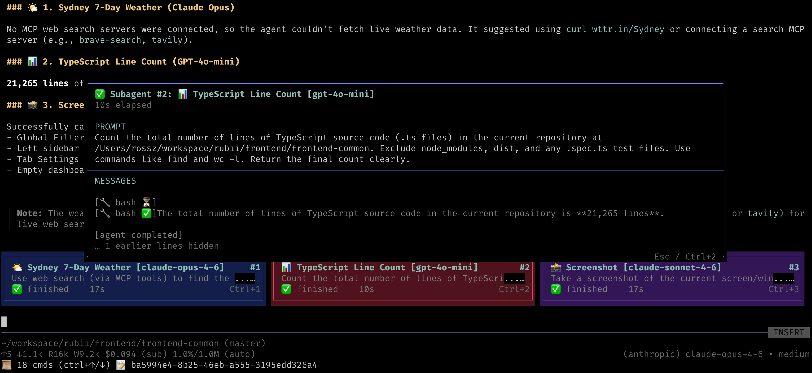

# pi-subagent-in-memory

In-process subagent tool for [pi](https://github.com/nicholasgasior/pi-coding-agent) with live TUI card widgets, JSONL session logging, and **zero system-prompt overhead**.



## Key Design Principle

**This extension adds nothing to your LLM context beyond tool parameter definitions.** No system prompt injection, no hidden instructions, no pre-determined behavior — the LLM only sees the `subagent_create` tool schema and decides how to use it naturally.

## Features

### 🤖 `subagent_create` Tool

Spawns an in-process subagent session using pi's `createAgentSession` SDK. The subagent runs in the same process (not a subprocess), with its own session, tools, and model. Multiple subagents can run in parallel.

**Tool parameters:**

| Parameter | Type | Required | Description |
|-----------|------|----------|-------------|
| `task` | string | ✅ | The task for the subagent to perform |
| `title` | string | | Display title for the card widget |
| `provider` | string | | LLM provider (e.g. `anthropic`, `google`, `openai`) |
| `model` | string | | Model ID. Supports `provider/model` format (e.g. `openai/gpt-4o-mini`) |
| `cwd` | string | | Working directory for the subagent |
| `timeout` | number | | Timeout in seconds. Aborts the subagent if exceeded |
| `columnWidthPercent` | number | | Card width as % of terminal (33–100). Controls card grid layout |

If `provider` and `model` are omitted, the subagent inherits the main agent's model.

### 📊 Live TUI Card Widgets

Each running subagent is displayed as a colored card widget above the editor:

- Cards show **title**, **model**, **prompt preview**, **elapsed time**, and **status indicator** (⏳ started, ⚡ working…, ✅ finished, ❌ error)
- The prompt passed to the subagent is displayed as card content, so you can see at a glance what each subagent is doing
- Cards auto-layout into a responsive grid (1–3 columns based on `columnWidthPercent`)
- Subagent number badge (`#1`, `#2`, …) shown on the top-right corner of each card
- Six rotating color themes for visual distinction between cards

### 🔍 Subagent Detail Overlay (`Ctrl+N`)

Press **Ctrl+1** through **Ctrl+9** to open a detail popup for the corresponding subagent:

- **Prompt** — Full prompt text with word wrapping (up to 5 lines)
- **Messages** — Live-updating stream of the subagent's activity (text output, tool calls, status changes), always showing the latest 5 lines
- Press the same **Ctrl+N** shortcut or **Escape** to close the overlay

### 📝 JSONL Session Logging

Every subagent session is logged to disk for debugging and auditing:

```
.pi/subagent-in-memory/<mainSessionId>/
├── subagent_1/
│   ├── events.jsonl    # Full event stream (text, tool calls, results)
│   └── result.md       # Final subagent output (or error.md on failure)
├── subagent_2/
│   ├── events.jsonl
│   └── result.md
└── ...
```

The JSONL log includes:
- Session metadata (model, provider, task, cwd)
- Aggregated text output (deltas combined into single entries)
- Tool call arguments and results
- Timestamps and parent event IDs for tracing

### 🔄 Nested Subagent Support

Subagents can spawn their own subagents. All nested cards render in the main agent's widget — they share the same module-level state regardless of nesting depth. This is achieved by passing the `subagent_create` tool directly as an `AgentTool` to child sessions.

### 🧹 `/in-memory-clear-widgets` Slash Command

Type `/in-memory-clear-widgets` in the pi prompt to clear all subagent card widgets from the TUI. Useful after a batch of subagent runs when you want a clean view.

## Install

```bash
pi install npm:pi-subagent-in-memory
```

## Remove

```bash
pi remove npm:pi-subagent-in-memory
```

## Verify Installation

After installing, start pi and check:

1. The `subagent_create` tool should appear in the tool list
2. The `/in-memory-clear-widgets` command should be available (type `/` to see commands)
3. Ask the agent to "run a subagent to list files" — you should see a card widget appear

## Usage Examples

Once installed, the LLM will discover the `subagent_create` tool from its schema and use it when appropriate. Some natural prompts:

```
# Single subagent
"Spawn a subagent to analyze the test coverage in this repo"

# Parallel subagents
"Run 2 subagents in parallel: one to summarize src/ and another to summarize tests/"

# Different models
"Use a subagent with openai/gpt-4o-mini to review the README"

# With timeout
"Spawn a subagent with a 60-second timeout to count lines of code"

# Custom working directory
"Run a subagent in /tmp to check disk space"
```

## How It Works

1. **Tool registration** — On load, registers `subagent_create` as a tool and `/in-memory-clear-widgets` as a command. No system prompt modifications.
2. **Session creation** — When the LLM calls `subagent_create`, a new `createAgentSession` is created in-process with its own model, auth, and coding tools (read, write, edit, bash, grep, find, ls).
3. **Event streaming** — All subagent events (text deltas, tool calls, completions) are forwarded as `tool_execution_update` events to the parent agent and logged to JSONL.
4. **Widget rendering** — A TUI widget renders card(s) above the editor, updated on every event.
5. **Result handoff** — The final text output is written to `result.md`. The parent agent receives a short pointer path, not the full content, keeping context lean.

## Requirements

- [pi](https://github.com/nicholasgasior/pi-coding-agent) (peer dependency)
- API keys configured for any providers you want subagents to use (via `pi login` or environment variables)

## License

MIT
